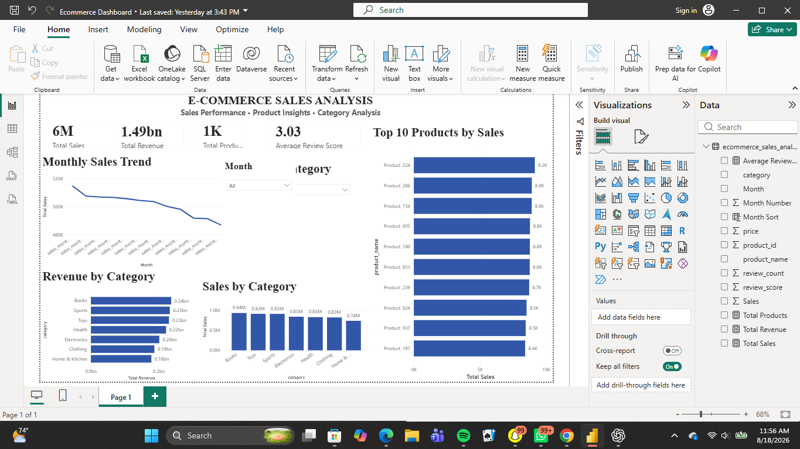

# 🛒 E-Commerce Sales Analysis Dashboard

## 📊 Project Overview

This project analyzes an e-commerce sales dataset using **Microsoft Power BI** to uncover sales performance, revenue trends, category performance, and product-level insights.

The goal was to transform raw e-commerce data into an interactive dashboard that allows users to quickly understand business performance and identify top-performing products and categories.

---

## 🛠️ Tools & Technologies

- **Microsoft Power BI**
- **Power Query** – Data cleaning and transformation
- **DAX** – Calculated measures and KPIs
- **Data Visualization**
- **Microsoft Excel / CSV Dataset**

---

## 🧹 Data Preparation

The dataset was prepared using Power Query before building the dashboard.

Key preparation steps included:

- Promoting and organizing column headers
- Checking and correcting data types
- Cleaning and transforming columns
- Creating a numerical month field for chronological analysis
- Creating a month sorting field
- Validating data quality and removing inconsistencies

---

## 📈 Key KPIs

The dashboard includes the following key performance indicators:

- **Total Sales:** 6M
- **Total Revenue:** 1.49bn
- **Total Products:** 1K
- **Average Review Score:** 3.03

---

## 📊 Dashboard Features

### Monthly Sales Trend
Shows how total sales change across the different sales months.

### Sales by Category
Compares total sales performance across product categories.

### Revenue by Category
Highlights which categories generate the most revenue.

### Top 10 Products by Sales
Identifies the highest-selling products based on total sales.

### Interactive Filters
Users can filter the dashboard by:

- Month
- Category

The visualizations and KPI cards respond dynamically to the selected filters.

---

## 🔍 Key Insights

From the analysis:

- **Books** generated the highest total sales among the analyzed categories.
- **Books** also generated the highest revenue.
- **Product_224** was the top-performing product by sales in the dashboard.
- Sales performance varied across the different months.
- The dashboard provides an interactive way to compare category and product performance.

---

## 🎯 Business Objective

The dashboard was designed to help an e-commerce business:

- Monitor overall sales performance
- Identify high-performing categories
- Identify top-selling products
- Track sales trends over time
- Support data-driven decision making

---

## 📷 Dashboard Preview

---

## 🚀 Project Outcome

This project demonstrates my ability to take raw data through the complete analytics workflow:

**Raw Data → Data Cleaning → Data Transformation → DAX → Data Visualization → Business Insights**

It also strengthened my practical skills in **Power BI, Power Query, DAX, data visualization, and business analysis**.

---

## 👨🏽‍💻 Author

**Olumide Joseph**

Computer Science & Cybersecurity Student  
Aspiring Data Analyst | Power BI | Python | SQL

🔗 GitHub: [OlumideJoe2007](https://github.com/OlumideJoe2007)
